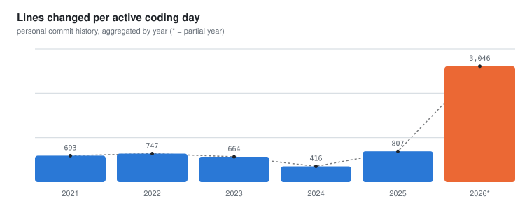

- 👋 Hi, I'm @apandeya
- 🛠️ Backend & data engineer
- 🌱 Currently exploring AI-assisted / agentic coding workflows — see the chart below 👇

<!-- CHART:START -->
<picture>
  <source media="(prefers-color-scheme: dark)" srcset="stats/coding-velocity-dark.svg">
  <source media="(prefers-color-scheme: light)" srcset="stats/coding-velocity-light.svg">
  
</picture>

🔥 Active on 22 of the last 30 days &nbsp;·&nbsp; _last updated 2026-08-20_
<!-- CHART:END -->

Full year-by-year breakdown ▾

<!-- STATS:START -->
| Year | Commits | LOC changed | Active days | LOC/day | Median LOC/commit | Mean LOC/commit | Repos touched |
|---|---|---|---|---|---|---|---|
| 2021 | 436 | 42,976 | 62 | 693 | 6 | 98.6 | 10 |
| 2022 | 954 | 121,837 | 163 | 747 | 4 | 127.7 | 21 |
| 2023 | 1,069 | 109,628 | 165 | 664 | 5 | 102.6 | 24 |
| 2024 | 567 | 44,482 | 107 | 416 | 4 | 78.5 | 21 |
| 2025 | 377 | 92,832 | 115 | 807 | 38 | 246.2 | 18 |
| 2026 \* | 860 | 322,900 | 106 | 3,046 | 34.5 | 375.5 | 33 |

\* partial year
<!-- STATS:END -->

<!---
apandeya/apandeya is a ✨ special ✨ repository because its `README.md` (this file) appears on your GitHub profile.
You can click the Preview link to take a look at your changes.
--->
